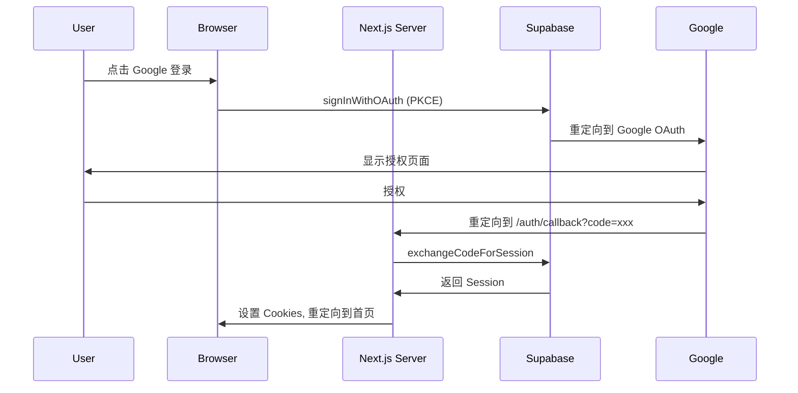
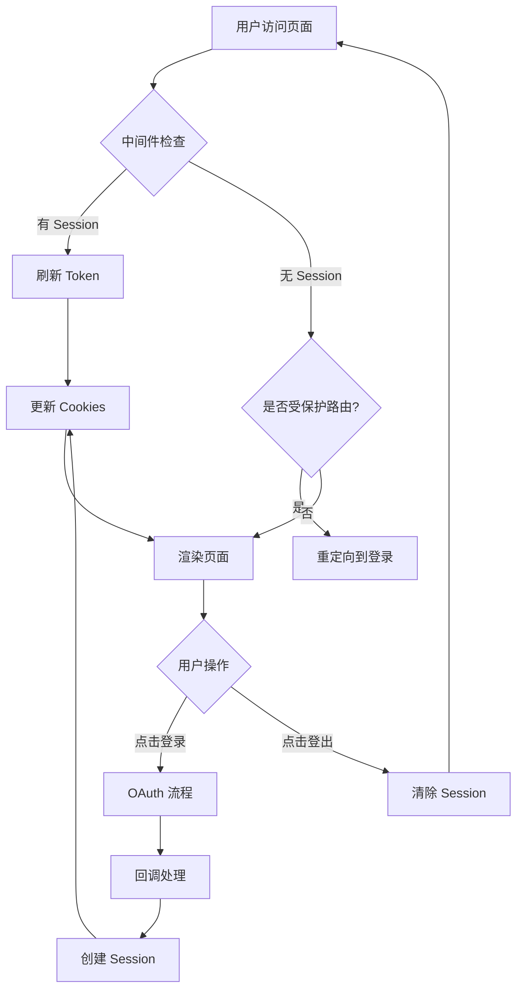

# Design Document: Supabase Google Auth

## Overview

本设计文档描述了在 Nano Banana AI 图像编辑器中实现基于 Supabase 的 Google 登录功能。采用服务器端认证（SSR）方式，使用 PKCE 流程确保安全性，并集成 Google One-Tap 登录以提升用户体验。

### 技术栈
- Next.js 16 (App Router)
- Supabase Auth (@supabase/supabase-js, @supabase/ssr)
- TypeScript
- React 19

### 认证流程概述



## Architecture

### 目录结构

```
├── lib/
│   └── supabase/
│       ├── client.ts          # 浏览器端 Supabase 客户端
│       ├── server.ts          # 服务器端 Supabase 客户端
│       └── middleware.ts      # 中间件辅助函数
├── app/
│   └── auth/
│       └── callback/
│           └── route.ts       # OAuth 回调处理
├── components/
│   ├── auth-button.tsx        # 登录/登出按钮组件
│   └── google-one-tap.tsx     # Google One-Tap 组件
├── middleware.ts              # Next.js 中间件
└── .env.local                 # 环境变量
```

### 数据流



## Components and Interfaces

### 1. Supabase 客户端工厂

#### Browser Client (`lib/supabase/client.ts`)

```typescript
import { createBrowserClient } from '@supabase/ssr'

export function createClient() {
  return createBrowserClient(
    process.env.NEXT_PUBLIC_SUPABASE_URL!,
    process.env.NEXT_PUBLIC_SUPABASE_ANON_KEY!
  )
}
```

#### Server Client (`lib/supabase/server.ts`)

```typescript
import { createServerClient } from '@supabase/ssr'
import { cookies } from 'next/headers'

export async function createClient() {
  const cookieStore = await cookies()

  return createServerClient(
    process.env.NEXT_PUBLIC_SUPABASE_URL!,
    process.env.NEXT_PUBLIC_SUPABASE_ANON_KEY!,
    {
      cookies: {
        getAll() {
          return cookieStore.getAll()
        },
        setAll(cookiesToSet) {
          try {
            cookiesToSet.forEach(({ name, value, options }) =>
              cookieStore.set(name, value, options)
            )
          } catch {
            // Server Component 中无法设置 cookies
          }
        },
      },
    }
  )
}
```

### 2. 认证中间件 (`middleware.ts`)

```typescript
import { createServerClient } from '@supabase/ssr'
import { NextResponse, type NextRequest } from 'next/server'

// 受保护的路由模式
const protectedRoutes = ['/generator', '/dashboard']

export async function middleware(request: NextRequest) {
  let supabaseResponse = NextResponse.next({
    request,
  })

  const supabase = createServerClient(
    process.env.NEXT_PUBLIC_SUPABASE_URL!,
    process.env.NEXT_PUBLIC_SUPABASE_ANON_KEY!,
    {
      cookies: {
        getAll() {
          return request.cookies.getAll()
        },
        setAll(cookiesToSet) {
          cookiesToSet.forEach(({ name, value }) => 
            request.cookies.set(name, value)
          )
          supabaseResponse = NextResponse.next({
            request,
          })
          cookiesToSet.forEach(({ name, value, options }) =>
            supabaseResponse.cookies.set(name, value, options)
          )
        },
      },
    }
  )

  // 刷新 session
  const { data: { user } } = await supabase.auth.getUser()

  // 检查受保护路由
  const isProtectedRoute = protectedRoutes.some(route => 
    request.nextUrl.pathname.startsWith(route)
  )

  if (isProtectedRoute && !user) {
    const url = request.nextUrl.clone()
    url.pathname = '/login'
    url.searchParams.set('redirectTo', request.nextUrl.pathname)
    return NextResponse.redirect(url)
  }

  return supabaseResponse
}

export const config = {
  matcher: [
    '/((?!_next/static|_next/image|favicon.ico|.*\\.(?:svg|png|jpg|jpeg|gif|webp)$).*)',
  ],
}
```

### 3. OAuth 回调处理 (`app/auth/callback/route.ts`)

```typescript
import { createClient } from '@/lib/supabase/server'
import { NextResponse } from 'next/server'

export async function GET(request: Request) {
  const { searchParams, origin } = new URL(request.url)
  const code = searchParams.get('code')
  const next = searchParams.get('next') ?? '/'

  if (code) {
    const supabase = await createClient()
    const { error } = await supabase.auth.exchangeCodeForSession(code)
    
    if (!error) {
      return NextResponse.redirect(`${origin}${next}`)
    }
  }

  // 错误处理：重定向到错误页面
  return NextResponse.redirect(`${origin}/auth/auth-code-error`)
}
```

### 4. 认证按钮组件 (`components/auth-button.tsx`)

```typescript
'use client'

import { createClient } from '@/lib/supabase/client'
import { useEffect, useState } from 'react'
import { User } from '@supabase/supabase-js'
import { Button } from '@/components/ui/button'
import { Avatar, AvatarFallback, AvatarImage } from '@/components/ui/avatar'

export function AuthButton() {
  const [user, setUser] = useState<User | null>(null)
  const [loading, setLoading] = useState(true)
  const supabase = createClient()

  useEffect(() => {
    const getUser = async () => {
      const { data: { user } } = await supabase.auth.getUser()
      setUser(user)
      setLoading(false)
    }
    getUser()

    const { data: { subscription } } = supabase.auth.onAuthStateChange(
      (_event, session) => {
        setUser(session?.user ?? null)
      }
    )

    return () => subscription.unsubscribe()
  }, [supabase])

  const handleSignIn = async () => {
    await supabase.auth.signInWithOAuth({
      provider: 'google',
      options: {
        redirectTo: `${window.location.origin}/auth/callback`,
      },
    })
  }

  const handleSignOut = async () => {
    await supabase.auth.signOut()
    window.location.reload()
  }

  if (loading) {
    return <Button variant="outline" disabled>Loading...</Button>
  }

  if (user) {
    return (
      <div className="flex items-center gap-2">
        <Avatar className="h-8 w-8">
          <AvatarImage src={user.user_metadata.avatar_url} />
          <AvatarFallback>{user.email?.[0].toUpperCase()}</AvatarFallback>
        </Avatar>
        <Button variant="outline" onClick={handleSignOut}>
          Sign Out
        </Button>
      </div>
    )
  }

  return (
    <Button onClick={handleSignIn} variant="outline">
      Sign in with Google
    </Button>
  )
}
```

### 5. Google One-Tap 组件 (`components/google-one-tap.tsx`)

```typescript
'use client'

import Script from 'next/script'
import { createClient } from '@/lib/supabase/client'
import { useRouter } from 'next/navigation'
import { useEffect, useState } from 'react'

declare global {
  interface Window {
    google?: {
      accounts: {
        id: {
          initialize: (config: GoogleOneTapConfig) => void
          prompt: () => void
        }
      }
    }
  }
}

interface GoogleOneTapConfig {
  client_id: string
  callback: (response: CredentialResponse) => void
  nonce: string
  use_fedcm_for_prompt: boolean
}

interface CredentialResponse {
  credential: string
}

// 生成 nonce
const generateNonce = async (): Promise<[string, string]> => {
  const nonce = btoa(
    String.fromCharCode(...crypto.getRandomValues(new Uint8Array(32)))
  )
  const encoder = new TextEncoder()
  const encodedNonce = encoder.encode(nonce)
  const hashBuffer = await crypto.subtle.digest('SHA-256', encodedNonce)
  const hashArray = Array.from(new Uint8Array(hashBuffer))
  const hashedNonce = hashArray
    .map((b) => b.toString(16).padStart(2, '0'))
    .join('')

  return [nonce, hashedNonce]
}

export function GoogleOneTap() {
  const supabase = createClient()
  const router = useRouter()
  const [hasSession, setHasSession] = useState<boolean | null>(null)

  useEffect(() => {
    const checkSession = async () => {
      const { data } = await supabase.auth.getSession()
      setHasSession(!!data.session)
    }
    checkSession()
  }, [supabase])

  const initializeGoogleOneTap = async () => {
    if (hasSession) return

    const [nonce, hashedNonce] = await generateNonce()

    const { data: sessionData } = await supabase.auth.getSession()
    if (sessionData.session) {
      return
    }

    window.google?.accounts.id.initialize({
      client_id: process.env.NEXT_PUBLIC_GOOGLE_CLIENT_ID!,
      callback: async (response: CredentialResponse) => {
        const { error } = await supabase.auth.signInWithIdToken({
          provider: 'google',
          token: response.credential,
          nonce,
        })

        if (!error) {
          router.push('/')
          router.refresh()
        }
      },
      nonce: hashedNonce,
      use_fedcm_for_prompt: true,
    })

    window.google?.accounts.id.prompt()
  }

  if (hasSession === null || hasSession) {
    return null
  }

  return (
    <Script
      src="https://accounts.google.com/gsi/client"
      onReady={initializeGoogleOneTap}
    />
  )
}
```

## Data Models

### Session 数据结构

```typescript
interface Session {
  access_token: string
  refresh_token: string
  expires_in: number
  expires_at?: number
  token_type: string
  user: User
}

interface User {
  id: string
  email?: string
  user_metadata: {
    avatar_url?: string
    full_name?: string
    email?: string
  }
  app_metadata: {
    provider?: string
  }
}
```

### Cookie 结构

Supabase SSR 使用以下 cookies 存储会话：
- `sb-<project-ref>-auth-token`: 主要的认证 token（分块存储）
- `sb-<project-ref>-auth-token.0`, `.1`, etc.: Token 分块

## Correctness Properties

*A property is a characteristic or behavior that should hold true across all valid executions of a system-essentially, a formal statement about what the system should do. Properties serve as the bridge between human-readable specifications and machine-verifiable correctness guarantees.*

### Property 1: Token Refresh Consistency

*For any* expired session token, when the middleware processes a request, the token SHALL be refreshed and the new token SHALL be propagated to both cookies and the response.

**Validates: Requirements 1.4, 4.2**

### Property 2: Session Retrieval Consistency

*For any* valid session stored in cookies, both the Server_Client and Browser_Client SHALL be able to retrieve the same session data.

**Validates: Requirements 4.4, 4.5**

### Property 3: Header Auth State Display

*For any* authentication state (authenticated or unauthenticated), the Header component SHALL display the appropriate UI elements (login button for unauthenticated, avatar and logout for authenticated).

**Validates: Requirements 5.1, 5.2**

### Property 4: Route Protection Enforcement

*For any* protected route and any user, access SHALL be granted if and only if the user has a valid session.

**Validates: Requirements 6.1, 6.2, 6.3**

### Property 5: Google One-Tap Session-Based Display

*For any* page load, the Google One-Tap prompt SHALL be displayed if and only if there is no active session.

**Validates: Requirements 3.1, 3.2**

### Property 6: Nonce Generation Uniqueness

*For any* two consecutive nonce generations, the generated nonces SHALL be different (with high probability due to cryptographic randomness).

**Validates: Requirements 3.5**

### Property 7: Auth State Change Reactivity

*For any* authentication state change event, the Header component SHALL update its display without requiring a page refresh.

**Validates: Requirements 5.5**

## Error Handling

### OAuth 错误处理

| 错误场景 | 处理方式 |
|---------|---------|
| Google 授权失败 | 重定向到 `/auth/auth-code-error`，显示错误信息 |
| Code 交换失败 | 记录错误日志，重定向到错误页面 |
| Token 刷新失败 | 清除 session，重定向到登录页 |
| 网络错误 | 显示 toast 提示，允许重试 |

### 错误页面 (`app/auth/auth-code-error/page.tsx`)

```typescript
export default function AuthCodeError() {
  return (
    <div className="flex flex-col items-center justify-center min-h-screen">
      <h1 className="text-2xl font-bold mb-4">Authentication Error</h1>
      <p className="text-muted-foreground mb-4">
        There was an error during the authentication process.
      </p>
      <a href="/" className="text-primary hover:underline">
        Return to Home
      </a>
    </div>
  )
}
```

## Testing Strategy

### 单元测试

使用 Vitest 进行单元测试：

1. **Supabase 客户端创建测试**
   - 验证 Browser Client 正确创建
   - 验证 Server Client 正确创建并处理 cookies

2. **组件测试**
   - AuthButton 在不同认证状态下的渲染
   - GoogleOneTap 的条件渲染

3. **中间件测试**
   - 受保护路由的重定向逻辑
   - Token 刷新逻辑

### 属性测试

使用 fast-check 进行属性测试：

1. **Property 1**: Token Refresh Consistency
   - 生成随机的过期 token 状态
   - 验证刷新后 token 正确传播

2. **Property 4**: Route Protection Enforcement
   - 生成随机的路由和认证状态组合
   - 验证访问控制逻辑正确

3. **Property 6**: Nonce Generation Uniqueness
   - 多次生成 nonce
   - 验证所有生成的 nonce 都不相同

### 测试配置

```typescript
// vitest.config.ts 中已配置
// 每个属性测试运行至少 100 次迭代
```

## Environment Variables

```bash
# .env.local
NEXT_PUBLIC_SUPABASE_URL=your-supabase-url
NEXT_PUBLIC_SUPABASE_ANON_KEY=your-supabase-anon-key
NEXT_PUBLIC_GOOGLE_CLIENT_ID=your-google-client-id
```

## Dependencies

需要安装的新依赖：
```bash
pnpm add @supabase/supabase-js @supabase/ssr
```
